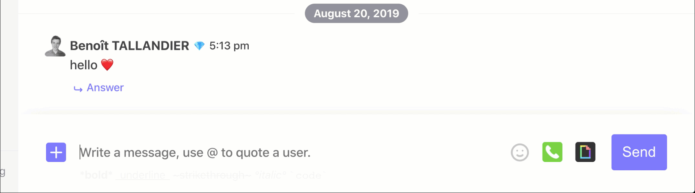
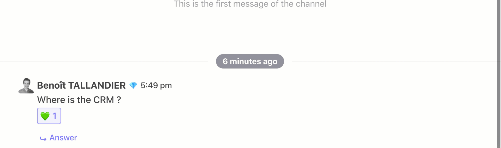
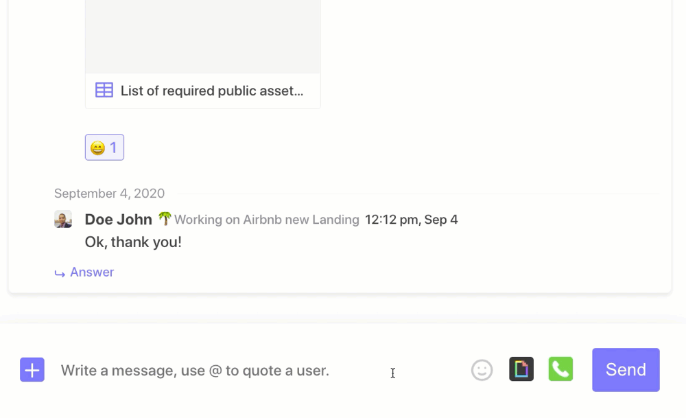

# Chat

The chat is the heart of Twake: this is where you communicate with your team, the two fundamental notions are
- Chat chain
- Message

## Channels

### Create a chain

To create a channel, you must have `Administrator` rights for the workspace in question. 

To create your channel, click on the `+` button right to the "Channel" inscription. Fill a name for your channel, select a wonderful emoji and select if it is a public or private channel \(by default, channels are private\).

### Public channel

Public channels are visible to all members of the workspace.

### Private channel

Private channels are only accessible to a limited number of users who must be invited to them. Users not present in these channels cannot see them in their workspace.

#### Modify the list of members of a private chain

You can choose the members of a private chain when you create it. To edit the list of members once the chain has been created, place your cursor on the chain, click on the `...` button and then click on `Participants`, you can then edit the list of members by adding or removing participants.

### Guest management

You can invite external members to your workspace in your channel. These external members can be added to one or more channels.
This feature is useful to invite users who are not part of your company. For example, you can invite freelancers to a dedicated channel to collaborate on a specific project. They will then only have access to the channels they are invited to and will not see the public channels.

### Mute a channel

You can mute a channel to receive only certain notifications about it: all messages, only those where you are tagged (via @username), none, etc.
To do this, place your cursor over the channel, click on the `...` button, then `Notifications` and select the notification mode you want. If you mute the channel completely, a crossed-out bell icon will appear.

### Bookmark a Channel

If a channel is important to you, you can bookmark it. The favorite channels are grouped at the top of the menu bar in a dedicated section.
Only you can see the channels you have bookmarked.
To bookmark a channel, place your cursor over the channel, click the `...` button, then click `Add to Favorites`. The channel will then be moved to the favorites section, and a star icon will appear next to its name.

## Messages

### Send a message

To send a message, select the channel you wish to post to. Click `Start New Thread` if you want to start a new thread, or `Reply` to reply to a thread already in progress. Enter your message and press `Enter` to send it.
There are tools for formatting the message, and you can create a new line via the keyboard shortcut `Shift + Enter`.

#### Pinning a message

If a message is important to the team, it is possible to pin it \(or unpin it\).

#### Reactions to messages

You can react to messages with one or more emoji. Hover over the message with your cursor, and select the desired emoji(s) in the selector. You can also click on the emoji already present to react with the same emoji.

#### Reply to a message

If a discussion has already started, you can participate in it and reply to a prompt by clicking on `Reply` at the bottom of the conversation?

#### View a thread

You can display a thread in a dedicated view. Hover over the message with your cursor, and click `View`. A panel appears on the right of the screen with the desired thread.

### Integration

#### Gif 

To send gifs in your posts, just click on the `...` in the post writing toolbar and click on Giphy to bring up the selector.

#### Videoconferencing

If you need a video conference, integration with Jitsi is possible at any time. Click on the camera icon in the message toolbar and the link will be published for the team.

#### Send a document

To send a document via chat, you can either drag and drop it from your file explorer directly into the message writing window, or paste it into that window if you copied it to your clipboard before, or by clicking the paperclip icon in the message writing toolbar to select the desired file from Twake's Drive or your computer.

