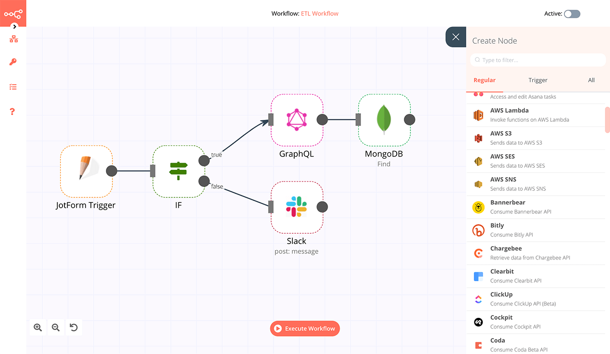

# Connectors

## n8n

### How to connect n8n to Twake

n8n is a powerful workflow automation tool that can be hosted by itself : [n8n.io](https://n8n.io)

#### Installing n8n in Twake

To install your n8n application in your workspace and get your key : 

Warning, the company admin must have authorized the installation of n8n and you must have at least the admin role of your workspace to install the n8n connector

#### Create your identifiers in n8n

Follow the steps shown in the gif below:

