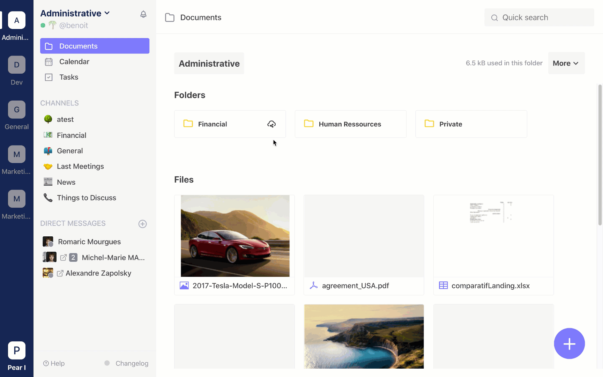

# Drive

## Share a file with a public link

In Twake, you can share your folders and files to an external user. Just create a public link for the document or folder and share it. External users clicking on the link will be able to access these documents without needing a Twake account.

### Create a public link

To create this link, click on the end menu of the document or folder you want to share, then on `Public Access` &gt; `Create Access Link`. You can now copy the link and share it.

### Delete a public link

Once a link is created, it remains active until it is deleted. If you want to delete it, just repeat the previous steps: click on the end menu of the document or folder you want to share, then on `Public Access` &gt; `Create Access Link` &gt; `Delete Link`.

