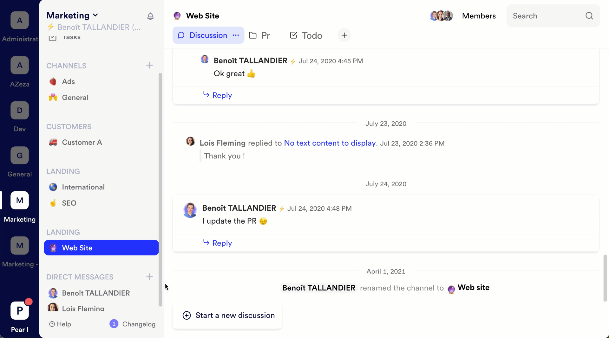
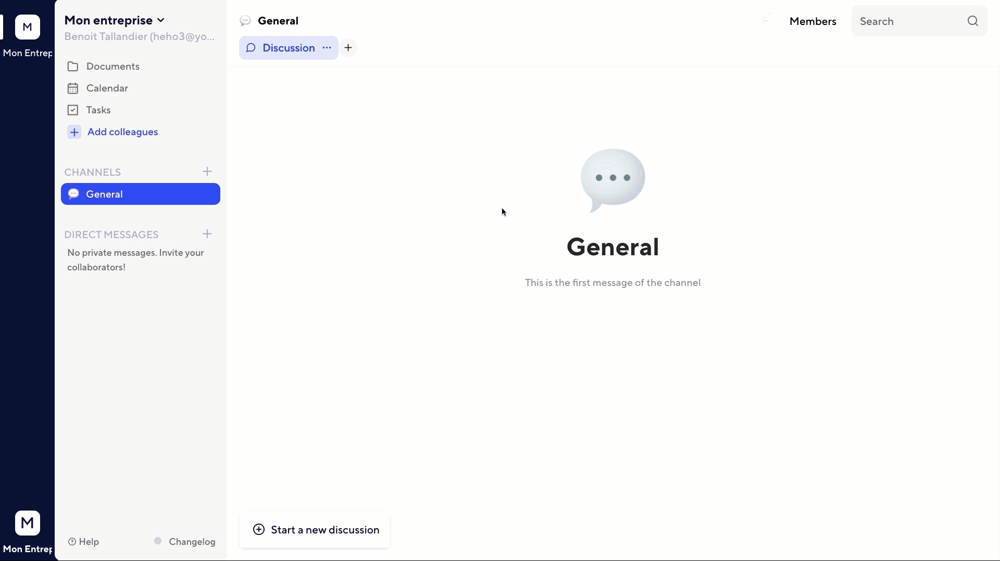
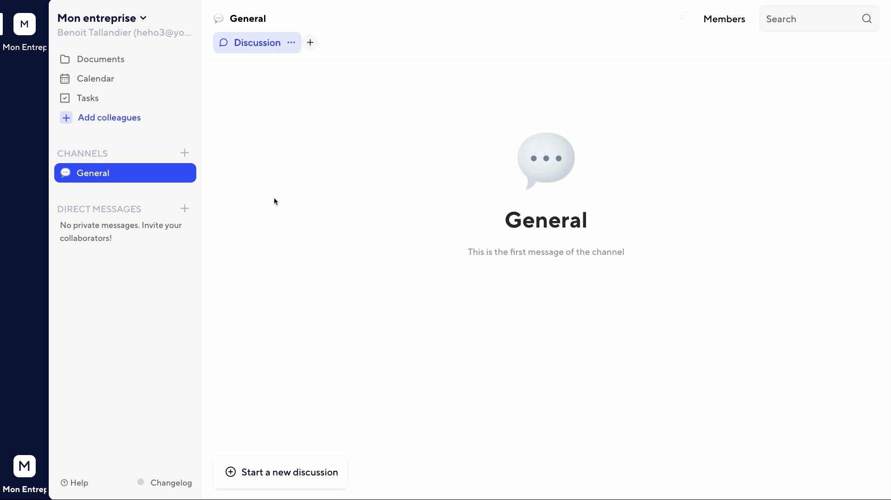
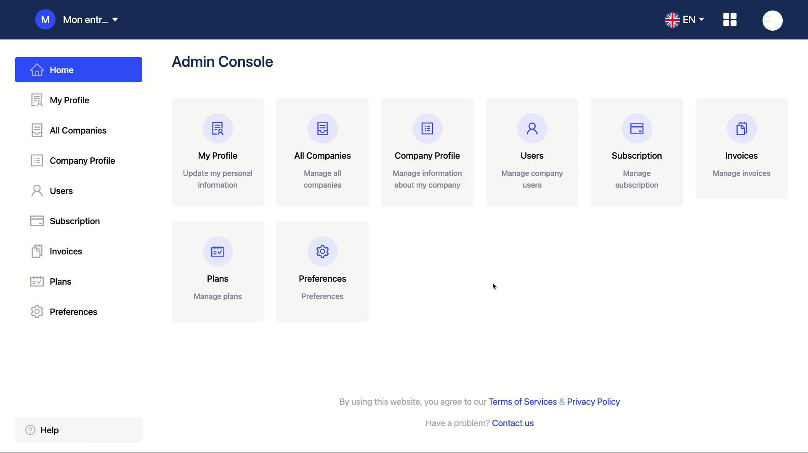

# Business & Workspace

## Companies

Companies are the largest entities on Twake. A company is the virtual representation of your company. You'll find all your employees in it, as well as connectors that you've developed specifically. Workspaces are spaces within a company.

You can belong to several companies, to change company, just click on the button at the bottom left of the screen:

<!--- La distinction Entreprise/Espace de travail mériterait d'être complétée pour être plus claire --->

## Workspace

Workspaces represent the teams or departments of your organization. Each workspace has its own members, discussions, files, tasks and calendar. This is the space in which your team collaborates.
The workspaces are listed on the left side of the screen.

## Invite a User from Chat

You can invite a user from your workspace.

To do this, open the menu by clicking on the workspace name, click on `Users` &gt; `Invite Users`, then type in the email of your colleagues \(separated by commas\) to add to the workspace, then click Add. You can also generate an invitation link to join the workspace.

You can also invite users from the console, refer to the dedicated page: Console > Users

# Rights management

Twake supports a fine definition of rights. Each user belongs to one or more workspaces in the same company. They can also have different statuses depending on whether they belong to a company or a workspace.

## Owner

The owner is the main administrator of a company. He can : 

* Allow connectors and applications to be installed in workspaces
* Change the company's identity
* Give and remove the rights associated with the "Company Admin" role to a member of the company

The creator of the company is the only owner. Only the owner of the company can transfer the owner status.

## Admin

An admin has the same rights as the owner. He can:

* Allow the installation of connectors and applications in the workspaces.
* Change the company's identity
* Give and remove the rights associated with the "Company Admin" role to a member of the company

To give the admin role, open the console \([console.twake.app](https://console.twake.app)\), in the menu, open the `Members` section, then click `Edit` on the member whose role you wish to change and select `Admin` before saving.

## Workspace Administrator

This role is the admin of the team. In addition to the rights of a regular user, he can:

* Add members to the workspace
* Add\/remove connectors and applications from the workspace
* Change the identity of the workspace
* Delete the workspace

By default, the workspace creator inherits the workspace admin role. This role can be combined with the company admin role.

To give the role of admin to a workspace, open the menu by clicking on the workspace name, click on `Users`, open the menu at the end of the line of the desired member and select `Admin`.

## User

The user role is the default role for workspace members. It can:

* Read and send messages on the private \(those to which he has been invited\) and public chat channels
* Create, edit, delete documents in the drive
* Create, edit, delete events and calendars
* Create, edit, delete tasks 
<!-- What is "tables" in the English version? --> 
* Create a workspace in the company

Since this is the default role, it is the role assigned to any user who is neither a company administrator, workspace administrator, nor guest.

## Guest

This role is intended for partners external to the organization who require access to Twake for a specific project or topic. A guest user can:

* Read and send messages in the channels to which they have been invited.

As a guest, they cannot join any channel by themselves - even if it is public. They must be invited by a user with at least User right.

To give a user the guest role, change their role in the console \([console.twake.app](https://console.twake.app)\), via the `Users` page.

<!-- Nécessaire de préciser ici comment inviter un utilisateur externe avec le statut "Invité" par défaut; nécessaire de l'ajouter d'abord dans la console, puis changer ses droits? -->

