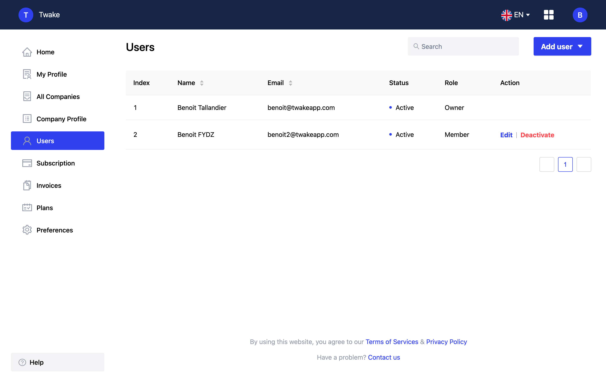
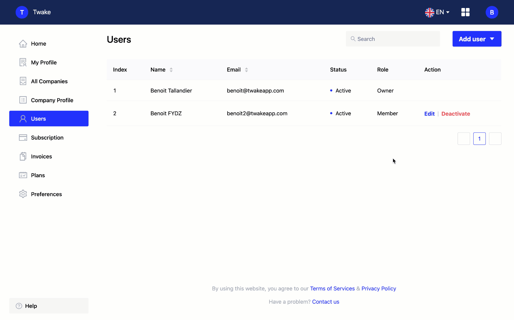

# Console

The console is where you will be able to manage your business and all the information shared on Twake, LinShare and more.

<!--- Not very clear wording --->

## Users

As an administrator, you have access to the user management page.

Open the console [console.twake.app](https://console.twake.app/) and click on `Members` in the right hand menu.

### Add a user

To work with your colleagues in a company, you have two possibilities:

* Create a user account
* Invite your colleague by email

You can also invite users from the chat, see : Companies > Invite a user from a chat

#### Send an invitation by email

To send an invitation by email, click on `Invite Members`, add the emails of the people you want to invite separated by commas and then click `Invite`. An email is then sent to each of the addresses entered. Your colleagues will receive it and will only have to click on the link in the email to join your company.

#### Create a user account

You can directly create accounts for your colleagues from the console by clicking on `Create a new member`, complete the fields and then validate them by clicking on `Create a user`. Once the fields are completed, you can fill in or randomly generate a password. All you have to do is to send the identifiers to your colleague.

