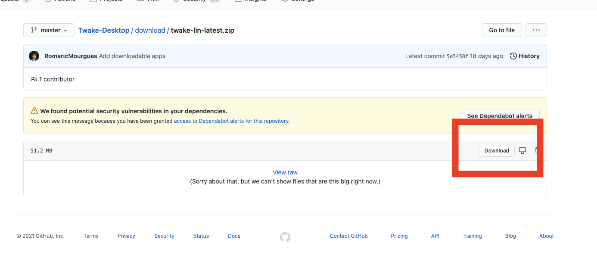

# Mobile & Desktop Applications

## Desktop

You can download Twake for Mac, Windows and Linux here: [https://github.com/linagora/Twake-Desktop/tree/master/download](https://github.com/linagora/Twake-Desktop/tree/master/download)

Click on the OS version you want and then on "Download".

### Change the Twake server used

By default, the Twake application is configured to connect to the Twake SaaS server provided by LINAGORA. If you wish to use another server, you can change the configuration by following one of the two methods below.

- On macOS, click on Help &gt: Change Twake Server or Help &gt; Change Twake Server and enter the URL of the desired server.
- On Windows, macOS and Linux, use the keyboard shortcut CTRL+ALT+SHIFT+S or CMD+ALT+SHIFT+S and enter the URL of the desired server

## Mobile Application

The mobile application is available for iOS & Android on the App Store and Play Store.

### Change the Twake server used

On the mobile app, simply log out of the app if you are, and click at the bottom left of the login page on "Change Server", then enter the URL of the desired server.

#### Push notifications

This feature is not yet available, let us know if you want to have this feature by putting a "thumbs up" emoji here: [https://github.com/TwakeApp/Twake/issues/130](https://github.com/TwakeApp/Twake/issues/130)

